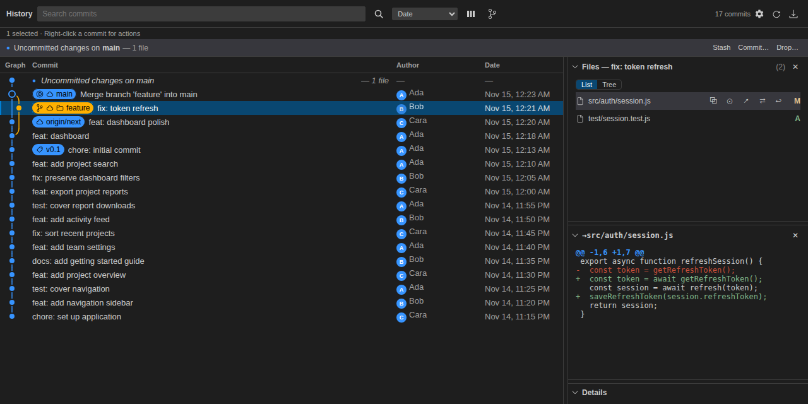
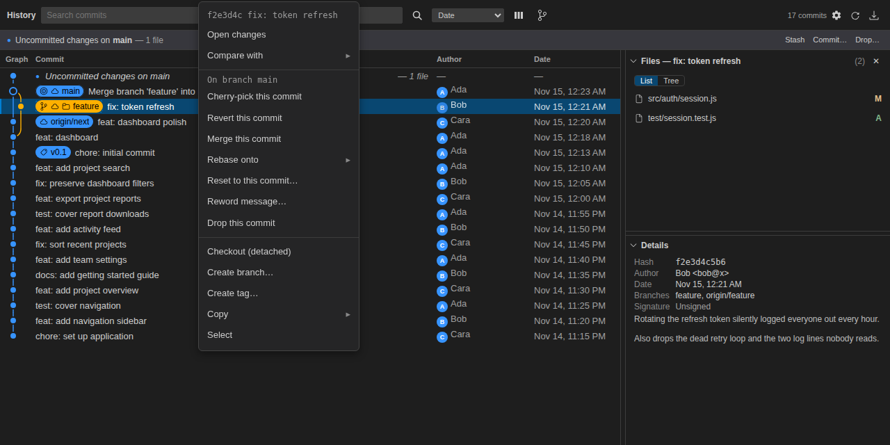

# Plegma

**See your Git history. Understand your changes. Keep your work moving.**

Plegma is a free, open source Git history extension for Visual Studio Code. It brings a visual commit graph, branches, tags, and file changes into one editor tab, so you can explore how your project evolved and act on that history without leaving VS Code.

Use it to follow a feature across branches, review what changed in a commit, compare your work with another branch, or tidy up commits before sharing them.



*Plegma's history view, shown with a sample repository.*

## Features

- **Explore your history visually.** Follow color-coded commit lanes and see where branches diverge and merge. Branch and tag labels show where each points, and commit details include the author, message, date, and signature status.
- **Find the work that matters.** Search commits, browse branches and tags, and filter the graph to the current branch or selected branches. Choose the commit order and visible columns to suit your workflow.
- **Review changes in context.** Select a commit to see its changed files and preview their differences. Open changes in VS Code's diff editors, compare commits or branches, and compare a revision with your uncommitted work.
- **Manage branches and remotes.** Create, switch, rename, and delete branches; create and manage tags; and fetch, pull, or push from the history view. Repository settings also let you manage remotes.
- **Shape your commit history.** Combine commits with squash, edit commit messages, drop commits, cherry-pick changes, revert commits, merge branches, rebase, or reset to an earlier point. Available actions follow the state of your repository.
- **Keep track of work in progress.** Review uncommitted changes and manage stashes: apply them, restore and remove them, or turn them into a branch. Switch between repositories in a workspace, and see the view refresh as your repository changes.

## Requirements

- Visual Studio Code **1.85 or later**.
- [Git](https://git-scm.com/) installed and available on your system's PATH.
- A folder or workspace containing a Git repository.

## Installation

In VS Code, open **Extensions**, search for **Plegma** by **jchrist**, and select **Install**.

If you have a packaged `.vsix` file, run **Extensions: Install from VSIX…** from the Command Palette and select it. To build a package yourself, see [Contributing](#contributing).

## Getting started

1. Open your project's folder or workspace in VS Code.
2. Click **Plegma** in the status bar, or run **Plegma: Open Window** from the Command Palette.
3. Select a commit to view its details and changed files. Click a file to preview its changes, or double-click it to open a diff editor.
4. Right-click a commit, branch label, or tag to see its available actions.

If your workspace contains multiple repositories, use the repository picker in the toolbar to choose which one to view.

To combine commits, select multiple commits and right-click the selection to choose **Squash into oldest**. To change a commit message, right-click the commit and choose **Reword message…**.



*Branch and commit actions are available directly from the graph.*

## Working with history

Plegma creates local backup references before rewriting history and asks for confirmation before destructive actions. When an operation needs a clean working tree, it can offer to stash your uncommitted changes first. If a merge or rebase stops with conflicts, the view provides controls to continue or abort; rebases also offer skip.

Rewriting history changes commit identities. Coordinate with collaborators before rewriting commits that others already use. Backups preserve the previous commit history; they do not recover discarded uncommitted changes or deleted stashes.

## Preferences

Open **Settings** from Plegma's toolbar to customize author avatars, visible columns, commit ordering, the default branch filter, and defaults for fetching, stashing, and resetting. View preferences are saved on your machine and are not synced through VS Code Settings Sync.

Author avatars are loaded from Gravatar. You can turn them off in Plegma's settings.

## Feedback and support

Report bugs and suggest improvements through [GitHub Issues](https://github.com/jchrist/plegma/issues). For a bug report, include your operating system, VS Code and Plegma versions, steps to reproduce the problem, and any relevant messages from the **Plegma** output channel. Remove private repository details before sharing logs or screenshots.

## Contributing

Bug fixes, documentation improvements, and feature contributions are welcome. For larger changes, open an issue first to discuss the approach. See [AGENTS.md](AGENTS.md) for project conventions and test guidance.

To work on the extension, download the source from [GitHub](https://github.com/jchrist/plegma) and open it in VS Code. Use Node.js **22.18+ or 24.11+** and the npm version specified in `package.json`, then run:

```sh
npm ci
npm run compile
npm test
```

Press **F5** to launch an Extension Development Host, then run **Plegma: Open Window** there. Run the build and tests before submitting a pull request, and include a regression test for behavior changes.

To build an installable `.vsix` file:

```sh
npm run package
```

## License

Plegma is licensed under the [MIT License](LICENSE).
